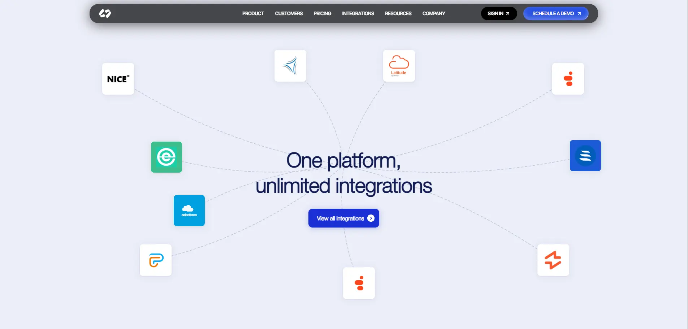

# UI Replication — Chargeflow & Domu

Pixel-perfect UI component replications of scroll-driven animations and interactive elements inspired by [Chargeflow](https://www.chargeflow.io/) and [Domu](https://domu.ai/).

**GitHub → [github.com/ornobaadi/ui-replication](https://github.com/ornobaadi/ui-replication)**

**Live demo → [ui-replication-practise.vercel.app](https://ui-replication-practise.vercel.app/)**

---

## Screenshot



---

## What was replicated

### Chargeflow — Scroll-shrinking navbar
A full-featured, responsive navigation bar that morphs as the user scrolls:
- Logo text fades out and the icon compresses on scroll
- Mega-menu dropdowns per navigation item (Product, Customers, Integrations, Resources, Company)
- Shimmer CTA button with animated gradient border
- Mobile menu with hamburger/close icon toggle
- Built purely with CSS transitions and a custom `useScroll` hook — no animation library required

### Domu — Converging integrations animation
A scroll-pinned section where integration logos curve inward from their scattered positions to a central hub:
- Bézier-curve paths drawn on an SVG canvas sized to the viewport
- Logos animate along their individual curved paths as the user scrolls through the sticky section
- Animated dashed stroke reveals the path ahead of each logo
- Integration logos include Salesforce, NICE, Arrow, Latitude, Polly, and others

---

## Tech stack

| Technology | Version |
|---|---|
| [Next.js](https://nextjs.org) | 16.x (App Router) |
| [React](https://react.dev) | 19 |
| [Tailwind CSS](https://tailwindcss.com) | v4 |
| [TypeScript](https://www.typescriptlang.org) | v5 |
| [Inter Tight](https://fonts.google.com/specimen/Inter+Tight) | Google Fonts |

---

## Project structure

```
app/
  layout.tsx               # Root layout with SEO metadata
  page.tsx                 # Main page composing all sections
  globals.css              # Global styles and Tailwind theme tokens
components/
  navbar.tsx               # Scroll-shrinking navbar (Chargeflow)
  converging-animation.tsx # Converging logos animation (Domu)
  ui/
    shimmer-button.tsx     # Animated shimmer CTA button
    menu-toggle-icon.tsx   # Hamburger ↔ close icon
    use-scroll.tsx         # useScroll hook (scroll position helper)
lib/
  utils.ts                 # cn() utility (clsx + tailwind-merge)
```

---

## Getting started

```bash
pnpm install
pnpm dev
```

Open [http://localhost:3000](http://localhost:3000) in your browser.

```bash
pnpm build   # Production build
pnpm start   # Start production server
```

---

## Notes

- External logo images are loaded from `framerusercontent.com` — allowed via `next.config.ts` `remotePatterns`.
- The Helvetica Neue Light font is served from `/public/Light.ttf`.
- No third-party animation libraries are used; all motion is driven by native CSS transitions and `requestAnimationFrame` via React `useEffect`.

---

## Assumptions

The following decisions were made where the reference designs were ambiguous or technically constrained:

### Navbar (Chargeflow)
- **Mega-menu content** — The dropdown panels contain marketing content (product descriptions, customer logos, integration partner cards) that is not publicly machine-readable. Card copy, brand logos, and imagery were reconstructed from visual inspection of the live site. External CDN image URLs (`cdn.prod.website-files.com`, `framerusercontent.com`) are used directly rather than re-hosting assets locally.
- **PRICING link** — The reference site's PRICING nav item links to a standalone page with no mega-menu. It is rendered as a plain anchor with no dropdown, consistent with the live behaviour.
- **Scroll threshold** — The navbar begins its pill-shrink transition once the page has scrolled more than 20 px. This value (via `useScroll(20)`) matches the perceived behaviour on the reference site.
- **Mobile breakpoint** — The hamburger menu is shown below Tailwind's `md` breakpoint (768 px), consistent with the reference site.
- **Font** — The reference site uses a proprietary licensed typeface. Inter Tight (Google Fonts) is used as the closest publicly available substitute with equivalent weight and optical sizing.
- **CTA wording** — The primary CTA reads "SCHEDULE A DEMO" on scroll (collapsed state) and "SIGN UP" in the expanded state, matching the reference site's two-state behaviour.

### Integrations section (Domu)
- **Logo selection** — Ten integration logos are shown in the scattered state, matching the approximate count visible on the reference. Logos were identified from the Domu site and sourced from `framerusercontent.com` where available; NICE and Salesforce are rendered as inline SVG/text because their images are not publicly hosted at a stable CDN URL.
- **Scroll distance** — The animation duration is derived dynamically from `sectionHeight − viewportHeight` so it scales correctly across all screen sizes, rather than being fixed to a pixel constant.
- **Center icon** — The converged end-state icon is the Domu logomark, reconstructed as an inline SVG from the SVG path data visible in the reference site's page source.
- **Background colour** — The off-white/lavender background (`#eceef8`) was sampled directly from the reference section.
- **Button hover** — The "View all integrations" CTA uses an expanding white-circle fill and a 3-D rotateX text-swap animation, closely matching the interaction on the reference site.

### General
- **No animation libraries** — All motion is implemented with native CSS transitions and `requestAnimationFrame`-driven scroll listeners. No Framer Motion, GSAP, or similar library is used.
- **Image optimisation** — External images are loaded with `unoptimized` on the Next.js `<Image>` component because they are served from third-party CDNs that do not support the Next.js image optimisation proxy.
- **`components.json`** — Present as a result of `shadcn` CLI initialisation used to scaffold the `cn` utility and base CSS tokens. No shadcn UI components are used at runtime.

---

## Credits

Designs inspired by:
- [chargeflow.io](https://www.chargeflow.io/) — chargeback dispute automation platform
- [domu.ai](https://domu.ai/) — AI-powered property intelligence
